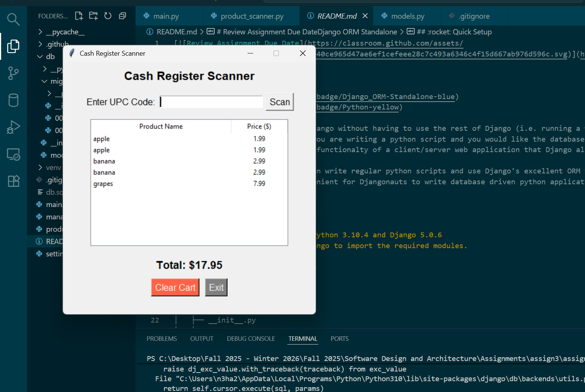

# Django and Energy Assignment
### Contributions
Part 1: Neha Khan
Part 2: Huda Saeed

### Project Overview and Setup

The following project is a standalone cash register application that uses Django ORM. Products to be sold can be populated with their name, upc code, and price in the database, and it contains a Graphical User Interface (GUI) for the user to simulate adding products to their cart according to their upc code, and calculates the total bill of all items.

The project is setup with the model for the product object created in db/models.py, the items are created and populate the database in main.py, and the product_scanner.py being the gui for the users to use the cash register system.

#### File structure

```
django-orm/
├── db/
│   ├── __init__.py
│   └── models.py
├── main.py
├── manage.py
├── README.md
├── product_scanner.py
├── screenshot.png
└── settings.py
```

### To run the project

- clone the repository on your local machine
- Create a virtual environment and install django `python -m venv venv; source venv/bin/activate; pip install django`
- Initialize the database `python manage.py makemigrations db; python manage.py migrate`
- run the project `python product_scanner.py`

### Example usage of the cash register


